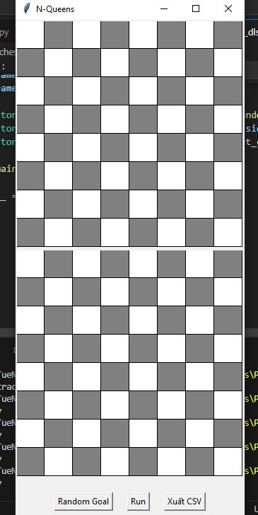

# BÀI TẬP CÁ NHÂN CHO TRÍ TUỆ NHÂN TẠO

Họ và Tên: Nguyễn Đức Tâm
MSSV: 23110151

# Mô tả:
Đây là các file áp dụng các thuật toán tìm kiếm để tìm kiếm vị trí đích trong bài toán 8 con hậu (8 con hậu đặt trên một bàn cờ và không thể diệt lẫn nhau)

# Giao Diện:

Giao diện gồm:
- Nút bấm "Random Goal": Mục đích để tạo đích đến.
- Nút bấm "Run" : Mục đích là để khởi chạy thuật toán (nó sẽ chạy và chúng ta sẽ nhìn thấy quá trình chạy của nó cho đến khi hoàn thành).
- Nút bấm "Xuất" : Mục đích xuất file csv hoặc txt để xem chi tiết quá trình.
- Một số thuật toán yêu cần đầu vào sửa đầu vào trực tiếp trong file code.

# Giới thiệu các thuật toán trong project:
- Project này gồm 13 thuật toán:

+ BFS : Thuật toán tìm kiếm theo chiều rộng

+ DFS : Thuật toán tìm kiếm theo chiều sâu

+ DLS : Thuật toán tìm kiếm theo chiều sâu nhưng có giới hạn (giới hạn trong code được đặt là 3)

+ IDS : Thuật toán tìm kiếm theo chiều sâu nhưng giới hạn lặp sâu dần

+ Gready : Thuật toán tìm kiếm tham lam theo chi phí (trong file code hàm greedy sẽ ưu tiên các vị trí tiếp theo giống goal hơn)

+ UCS : Thuật toán tìm kiếm theo chi phí (trong file code là có ít xung đột (ít hậu gần nhau) sẽ có chi phí thấp hơn)

+ A* : Thuật toán tìm kiếm theo chi phí với f = g + h, với g là chi phí từ vị trí bắt đầu đến vị trí hiện tại, h là chi phí ước lượng từ vị trí hiện tại đến đích 

+ Hill_Climbing: Thuật toán tìm kiếm tối ưu cục bộ mô tả quá trình leo núi hội tụ lên đỉnh, phù hợp với bài toán mà tất cả các quá trình tìm kiếm đều chỉ về 1 đích (file code của em không chạy chính xác được thuật toán này).

+ Simulated_annealing: Thuật toán tìm kiếm tối ưu cục bộ mô tả quá trình đun nóng và làm nguội của thuật luyện kim.

+ Beam_search : Thuật toán tìm kiếm cục bộ nhưng giới hạn hàng đợi với một số lượng beam_width

+ And_or_tree: Thuật toán tìm kiếm giải pháp cho bài toán có cấu trúc phân rã với node OR khi xét các trường hợp sinh ra từ node này thì chỉ cần một node có giá trị đúng còn với AND thì tất cả trường hợp được sinh ra phải đúng (file code của em cho tất các hàng xét liên tiếp là OR còn chỉ duy nhất hàng cuối mang giá trị AND)

+ Backtracking: Thuật toán tìm kiếm quay lui dùng đệ quy 
